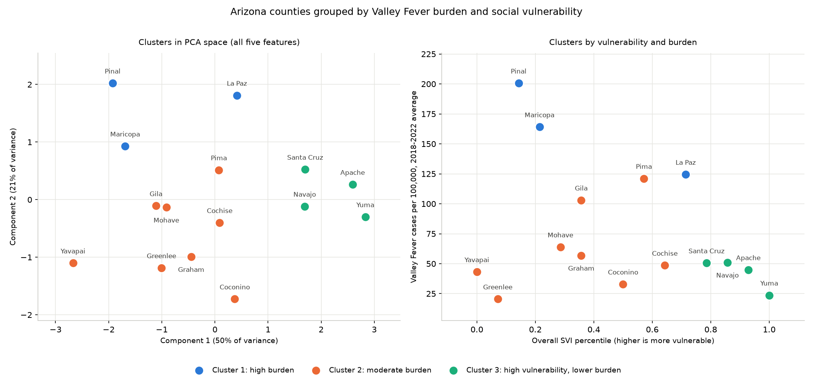

# Valley Fever patient grouping, by county

This groups Arizona's 15 counties by Valley Fever (coccidioidomycosis) burden combined with
social vulnerability. It pulls case counts and rates out of the Arizona Department of Health
Services 2023 annual report, joins them to the CDC/ATSDR Social Vulnerability Index, and
clusters the counties on the combined picture.

## Why counties instead of patients

The assignment is patient grouping, and I want to be upfront that this is not that. Individual
Valley Fever case records are protected health information. They are not public, and I would
need IRB approval and a data use agreement with ADHS to touch them.

I had two options. I could generate synthetic patient records, or I could group the smallest
real unit that is actually published. I went with real counties. Synthetic data would let me
demonstrate a clustering pipeline, but every result it produced would be a property of my
generator rather than a property of Valley Fever, and there would be no way to tell whether
the method found anything. County level data is coarse, but it is real, and the SDOH variables
attach to it cleanly because SVI is published at that geography. Ecological grouping like this
is a normal first pass in spatial epidemiology when patient records are out of reach.

The limitation that comes with it is the ecological fallacy. A cluster tells you something
about counties, not about the people in them. A high vulnerability county contains plenty of
people who are not vulnerable. I would not use these groupings to say anything about
individual patients.

## What it does

```bash
pip install -r requirements.txt
python run_analysis.py
```

The pipeline runs in six steps, one module each under `src/`:

1. `load_cases.py` pulls Table 2 out of the ADHS PDF. It finds the table by looking for a
   header with both "county" and "case" in it rather than by page number, strips the thousands
   separators and the footnote asterisks, and drops the statewide summary row that sits in the
   same table as the counties.
2. `load_svi.py` reads the SVI county file and keeps the overall score plus the four theme
   scores. It converts the CDC's `-999` missing code to a real null so that an unavailable
   score cannot quietly enter the model as a large negative number.
3. `join_datasets.py` joins the two on county name. ADHS writes "Santa Cruz" where the SVI file
   writes "Santa Cruz County", so names are normalized before matching. The join raises if
   either side has a county the other does not, because a silent partial join would drop
   counties from the clustering without saying so.
4. `clustering.py` builds the model.
5. `visualize.py` writes the plot.
6. `evaluate.py` scores the result and writes the assessment.

## How the code is put together

One module per pipeline stage, each one a function that takes a dataframe and returns a
dataframe. No shared state and no object holding half finished results. That means any stage
can be rerun or tested on its own, and you can read `join_datasets.py` without reading anything
else first.

The loaders fail loudly rather than degrading. The join raises if either source contains a
county the other does not, and the SVI loader raises if a score is missing. In a pipeline like
this, silently dropping a county would corrupt every number downstream, so a crash is the
cheaper failure.

Model settings live as named constants at the top of `clustering.py` rather than as literals
scattered through the code, so changing the feature set or k is a one line edit. Deciding,
judging and drawing are kept apart in `clustering.py`, `evaluate.py` and `visualize.py`, which
means swapping the algorithm does not touch the plotting code.

One detail worth calling out: the PDF table is located by looking for a header containing both
"county" and "case", not by page and row index. Next year's report will move things around, and
keyword matching survives that where hardcoded positions would not.

## The features, and one choice worth explaining

The model uses five features: the four SVI theme percentiles, plus the 2018 to 2022 average
case rate per 100,000.

I left the overall SVI score out of the model even though the loader keeps it. It is a rank
composite of the same four themes, so including both would count vulnerability twice against
a single burden measure. It stays in the output tables because it is easier to read than four
separate percentiles.

I used the five year average case rate rather than the 2023 rate. The ADHS report itself warns
that rates built on fewer than 20 cases move on random variation, and Greenlee shows exactly
why. Seven cases in 2023 produced a rate of 72.4 against a five year average of 20.5. That is
a three fold swing driven by a handful of cases. Both rates are reported, but the multi year
average is the more honest measure of a county's actual burden.

I also want to flag that I clustered on rates, not case counts. Maricopa reports 7,993 cases
and Greenlee reports 7, but that difference is almost entirely population size. Clustering on
counts would have produced a model that separates big counties from small ones.

## The clustering algorithm and why I picked it

Final model is Ward hierarchical clustering at k=3.

I ran K-means and Ward across k from 2 to 5 and compared them on silhouette and on how far the
two partitions agreed:

| k | K-means silhouette | Ward silhouette | Agreement (ARI) |
|---|---|---|---|
| 2 | 0.291 | 0.303 | 0.731 |
| 3 | 0.251 | 0.251 | 1.000 |
| 4 | 0.253 | 0.253 | 0.784 |
| 5 | 0.273 | 0.273 | 1.000 |

At k=3 the two algorithms return the identical partition. Adjusted Rand index is 1.000 and the
silhouette scores match to three decimals, meaning not one county is assigned differently. So
the algorithm choice does not change the answer here. Given that tie, I kept Ward because it is
deterministic. K-means depends on random initialization, and I would rather the result not
depend on a seed. Two unrelated algorithms landing on the same grouping is also mild evidence
that the structure is in the data rather than an artifact of one method.

On k, I should be straight about the tradeoff. Silhouette actually peaks at k=2, at 0.303
against 0.251. But that two way split only pulls out the four high vulnerability counties and
flattens the entire burden gradient, which is half of what I am trying to group on. k=3
recovers a distinct high burden group and costs about 0.05 of silhouette. k=4 scores the same
as k=3 and only splits off a two county fragment. I took the interpretable split over the
marginally better score, and I would rather state that plainly than present k=3 as the
obvious winner.

## What the clusters look like

| Cluster | Counties | Avg rate, 2018 to 2022 | Avg overall SVI | 2023 cases |
|---|---|---|---|---|
| 1, high burden | La Paz, Maricopa, Pinal | 163.1 | 0.36 | 9,012 |
| 2, moderate burden | Cochise, Coconino, Gila, Graham, Greenlee, Mohave, Pima, Yavapai | 61.3 | 0.35 | 1,778 |
| 3, high vulnerability, lower burden | Apache, Navajo, Santa Cruz, Yuma | 42.6 | 0.89 | 200 |



The left panel shows the clusters in PCA space across all five features. The right panel plots
overall vulnerability against case rate directly, which is the view I would actually put in
front of a public health reader.

Terminal output from a full run is in [results/terminal_output.png](results/terminal_output.png).
Cluster assignments are written to `results/cluster_assignments.csv`.

## How I evaluated it, and what I think it shows

Silhouette for the final model is 0.251. That is loose. It says there is real structure but the
counties do not fall into cleanly separated groups, which is roughly what I would expect from
15 units and social variables that vary continuously.

The more useful check was correlating burden against vulnerability across all 15 counties. It
comes out at r = -0.31 with p = 0.27. So the relationship is slightly negative and, at this
sample size, not distinguishable from no relationship at all.

That is the finding, and it is a negative one. High vulnerability and high case rate counties
do not group together in Arizona. The highest burden cluster is La Paz, Maricopa and Pinal.
The four most socially vulnerable counties are Apache, Navajo, Santa Cruz and Yuma. Those two
sets do not overlap at all. Valley Fever exposure follows the dry desert corridor through
Maricopa, Pinal and Pima more than it follows social disadvantage.

I think that makes the grouping useful, just not for the targeting exercise someone might have
expected. A program allocating by vulnerability alone would miss most of the case load. One
allocating by case rate alone would concentrate on relatively less vulnerable counties. Keeping
both axes visible is the point.

Two caveats I would not want to lose. Fifteen counties is a very small sample, and with n=15
almost nothing here reaches significance, so treat the correlation as a direction and not a
result. And Valley Fever is known to be underdiagnosed, so case rates partly reflect testing
practice rather than true incidence. If testing is more available in wealthier counties, that
would bias the rates in exactly the direction that would produce this negative correlation on
its own. I cannot separate those two explanations with this data.

## What it would take to make this a real research tool

Patient level case records through an IRB protocol and a data use agreement with ADHS. That is
the change that would matter most, because it would turn this from county grouping into actual
patient grouping and would remove the ecological fallacy problem.

Finer SDOH geography. SVI is published at census tract level, and Maricopa County alone holds
over four million people. Tract level would let the model see variation that county averages
erase completely.

Longitudinal case data rather than one report year. Several years of counts would separate
counties with persistently high burden from ones having a bad year, and would let me model
the environmental drivers, dust exposure and soil disruption and rainfall, that probably
explain more of the pattern than anything in SVI does.

Testing and diagnosis rates by county, so the underdiagnosis problem above could be adjusted
for instead of just noted.

## Data sources

- Arizona Department of Health Services, Valley Fever 2023 Annual Report. `data/valley-fever-2023.pdf`
- CDC/ATSDR Social Vulnerability Index, Arizona county file. `data/Arizona_county.csv`. This is
  the most recent release available at download time. The CSV itself does not carry a vintage
  column, so if the release year matters for citation it is worth confirming against the CDC
  download page rather than taking it from the file.

Both are public. Nothing here contains individual level data.
