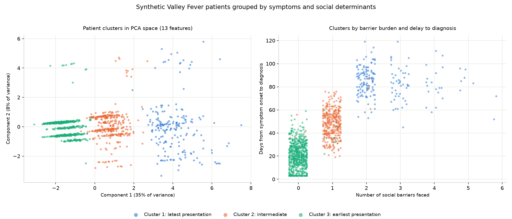

# Valley Fever patient grouping

This groups Valley Fever patients by their symptoms together with their social determinants of
health, so that patients who are similar to each other end up in the same group and different
from the other groups.

```bash
pip install -r requirements.txt
python run_analysis.py
```

## The patients are synthetic

The obvious risk with synthetic data is that you invent a pattern, find it again, and learn
nothing. I tried to close that gap by grounding the parts that can be grounded in real published
statistics.

Each patient is assigned to a county in proportion to that county's real 2023 case count, taken
from the ADHS annual report. Maricopa produces about 72 percent of the synthetic patients
because Maricopa reported about 73 percent of Arizona's actual cases. Each patient's social
determinants are then drawn at that county's real published prevalence from the CDC Social
Vulnerability Index. A patient from Yuma faces a 23.8 percent chance of not having finished high
school because that is Yuma's actual rate.

The result is a patient population whose social marginals match Arizona to within a point or
two:

| Determinant | Synthetic | Real Arizona |
|---|---|---|
| Housing cost burdened | 28.2% | 26.3% |
| Unemployed | 6.0% | 5.2% |
| No high school diploma | 11.5% | 11.0% |
| Limited social support | 6.8% | 6.2% |
| Uninsured | 11.5% | 10.7% |
| No vehicle | 6.2% | 5.3% |

Two things are not grounded, and I would rather name them than let them pass.

The link from social barriers to later presentation and worse disease is my assumption. The
direction is well supported in the care access literature, but the specific numbers are mine and
none of it is estimated from Valley Fever data. Every clinical pattern the clustering finds is a
pattern I put there.

Social support has no direct measure in the SVI, so single parent households stands in for it.
That is the weakest link in the mapping and I would replace it first given real data.

One modelling choice worth explaining. The six determinants are drawn correlated rather than
independently, through a shared per patient disadvantage term. Drawn independently, the average
patient carries 0.65 barriers and facing four or more becomes effectively impossible, which
deletes the group the whole exercise is about. Real barriers co-occur in the same person:
someone unemployed is more likely to be uninsured. The correlation leaves each county's marginal
prevalence unchanged and only changes how barriers stack up within a patient.

## The features

Thirteen features, both halves of what the brief describes.

Symptoms: days from onset to diagnosis, cough duration, fatigue score, fever, chest pain, weight
loss, disseminated disease.

Social determinants: housing cost burden, unemployment, education, social support, uninsured
status, no vehicle access. The last two are both access to care, kept separate because they are
different barriers and one patient can face either independently.

Everything is standardized before clustering. Days to diagnosis runs into the hundreds while the
determinants are 0 or 1, so without scaling the distance would be almost entirely the diagnosis
delay.

The generator also records which latent group each patient came from. That column is deliberately
not a clustering feature. It exists so the evaluation can ask whether the algorithm found the
structure that is actually there.

## How the code is organized

One module per stage under `src/`, each a function that takes a dataframe and returns a
dataframe. No shared state, no object holding half finished results, so any stage can be rerun
or read on its own.

`load_cases.py` and `load_svi.py` pull the real county numbers that ground the generator,
`generate_patients.py` builds the patient table, `cluster_patients.py` fits and compares models,
`visualize_patients.py` draws, and `run_analysis.py` orchestrates. Deciding, drawing and judging
are kept apart, so swapping the algorithm does not touch the plotting code. Model settings are
named constants at the top of `cluster_patients.py` rather than literals buried in the code, so
changing the feature set or k is a one line edit.

The loaders fail loudly rather than degrading. The SVI loader converts the CDC `-999` missing
code to a real null and then raises, because a missing rate would otherwise become a missing
barrier probability and quietly generate patients from an incomplete county. The two sources also
disagree on naming, "Santa Cruz County" against "Santa Cruz", so names are normalized in the
loader before any county is looked up.

One detail worth calling out: the case table is located in the PDF by looking for a header
containing both "county" and "case", not by page and row index. Next year's report will move
things around, and keyword matching survives that where hardcoded positions would not.

## The algorithm, and why silhouette would have picked wrong

Final model is K-means at k=3. I compared it against Ward hierarchical clustering across k from
2 to 6.

| k | K-means silhouette | Ward silhouette | K-means recovery | Ward recovery |
|---|---|---|---|---|
| 2 | 0.403 | 0.285 | 0.426 | 0.780 |
| 3 | 0.251 | 0.295 | **0.960** | 0.793 |
| 4 | 0.264 | 0.307 | 0.916 | 0.806 |
| 5 | 0.287 | 0.316 | 0.854 | 0.810 |
| 6 | 0.204 | 0.287 | 0.569 | 0.798 |

Recovery is the adjusted Rand index against the latent groups the data was generated from. It is
only computable because the data is synthetic, and it is the closest thing to a right answer this
exercise has.

Two things fall out of that table.

Ward scores slightly better on silhouette at k=3, 0.295 against 0.251, but K-means recovers the
true groups far better, 0.960 against 0.793. Since the point is to find the real groups, and this
is the one case where that can be measured, I decided on recovery. Silhouette only asks whether
the clusters are geometrically tidy, not whether they are right.

More importantly, silhouette alone would have chosen k=2, where it peaks at 0.403 and recovery
collapses to 0.426. Merging the single barrier and multiple barrier patients into one blob is
neater to look at and clinically useless. That gap is the entire argument for not treating an
internal metric as a verdict.

## What the groups look like

| Cluster | Patients | Days to diagnosis | Fatigue | Disseminated | Avg barriers | Uninsured |
|---|---|---|---|---|---|---|
| 1, latest presentation | 192 | 83.9 | 7.5/10 | 9.4% | 2.56 | 47% |
| 2, intermediate | 347 | 48.3 | 5.6/10 | 3.2% | 0.99 | 14% |
| 3, earliest presentation | 661 | 20.5 | 2.9/10 | 1.5% | 0.01 | 0% |



Terminal output from a full run is in [results/terminal_output.png](results/terminal_output.png).
Per patient assignments are in `results/patient_clusters.csv`.

## How I would evaluate the quality and usefulness

Quality and usefulness are separate questions and I think they deserve separate answers.

For quality, I used two measures that disagree, which is the useful part. Silhouette is 0.251,
which is loose. Recovery against the known groups is 0.960, which is near exact. Both are true at
once. The groups sit along a gradient rather than in separate lumps, so they overlap at the edges
while still being the right groups. Silhouette is measuring compactness and reading a gradient as
a weak result.

On real patient data only the silhouette number would be available. Taken alone it would suggest
the grouping barely worked, when in fact it recovered the structure almost perfectly. That is the
practical lesson I would carry into real data: internal metrics are a sanity check, not a verdict,
and they should be read alongside whether the groups differ on things you did not cluster on.

For usefulness, the test is whether the groups suggest different actions. These do. The latest
presenting cluster waits about three times as long for a diagnosis as the earliest, and carries
roughly six times the rate of disseminated disease. It is also the cluster where nearly half the
patients are uninsured. A clinic could act on that: patients presenting with two or more barriers
are the ones to reach earlier, and the group is large enough to matter at 16 percent of patients.

The honest caveat is that I built the barrier to delay relationship into the generator, so this
demonstrates that the method finds such a relationship when it exists. It is not evidence that
Arizona patients behave this way. Establishing that needs real records.

## One thing the county data ruled out

While checking the county numbers I looked at whether Valley Fever burden and social
vulnerability move together across Arizona's 15 counties. They do not. The correlation is
slightly negative, r = -0.31 with p = 0.27, and the highest burden counties (La Paz, Maricopa,
Pinal) do not overlap at all with the four most socially vulnerable (Apache, Navajo, Santa Cruz,
Yuma). Valley Fever exposure follows the dry desert corridor more than it follows disadvantage.

With 15 counties that is a direction rather than a finding, and underdiagnosis in poorer counties
could produce the same pattern on its own. But it settled one design question. I do not assume
vulnerability drives infection, so the generator does not link a patient's barriers to whether
they got sick. Barriers affect how late they present and how sick they are by then, which is a
different claim and the only one I make.

## What this would need to become a real research tool

Real patient records through an IRB protocol and a data use agreement with ADHS. That is the
change that matters most, because it would replace the one assumption doing real work here, the
link from barriers to delayed presentation, with something measured.

Symptom data recorded at presentation rather than modelled. Real symptom profiles are messier
than the ones here, with comorbidities and missing fields that would change which features are
usable.

A better measure of social support. Single parent households is a poor proxy and real research
would use something asked directly.

Longitudinal follow up, so that groups could be validated against outcomes rather than against
the structure they were generated from. The strongest evidence a grouping is useful is that the
groups go on to differ in ways nobody clustered on.

## Data sources

- Arizona Department of Health Services, Valley Fever 2023 Annual Report. `data/valley-fever-2023.pdf`
- CDC/ATSDR Social Vulnerability Index, Arizona county file. `data/Arizona_county.csv`. The CSV
  carries no vintage column, so confirm the release year against the CDC download page if it
  matters for citation.

Both are public. No individual level data is used anywhere, and no real patient records are
involved.
